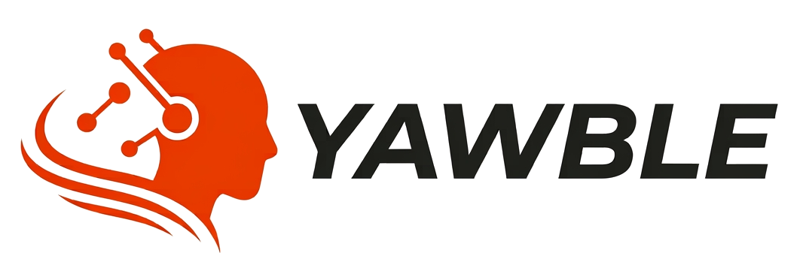

<p align="center">
  <picture>
    <source media="(prefers-color-scheme: dark)" srcset="web/public/logo-dark.png">
    
  </picture>
</p>

<p align="center"><strong>Yawble — A fleet of agents, moving with you.</strong></p>

**Run teams of AI coding agents on your own machine.** Yawble gives every person a Concierge to
talk to and hands the work to teams — a Manager and headless members built on the agent CLIs you
already use (Claude Code, Codex, GitHub Copilot CLI, Grok). Everything runs in one container you
control, with a web board to watch, steer and review the work.

[Website](https://yawble.ai) · [YouTube](https://www.youtube.com/@Yawble) · [X](https://x.com/_Yawble)

## Key features

- **A Concierge per person.** An interactive agent in a browser terminal that plans the job and
  dispatches it to teams.
- **Agent teams.** A Manager and members per team, each on the agent CLI and model you choose,
  woken by a message log rather than left running.
- **A board you can trust.** Kanban swimlanes, a backlog, live output from every running agent and
  the transcript of every past run.
- **Git-native.** Teams clone your repositories, and every card gets its own worktree and branch.
  Fetch, merge, push and pull requests stay a person's decision; contributor mode works from a fork.
- **Bounded and measured.** An instance-wide limit on running agents with a visible queue,
  per-workflow budgets, and token usage reported as measured, never estimated.
- **Triggers.** Wake a member on a schedule, on an event, or when files change in a folder.
- **Your machine, your keys.** Runs in Podman or Docker; each agent receives only its own
  provider's key. Data lives on one volume with automatic daily backups.
- **One operator CLI.** `yawble` installs, starts, updates, diagnoses and (optionally) exposes an
  instance through Cloudflare, Tailscale or ngrok.

## Quick start

You need Podman (recommended) or Docker. `yawble up` tells you where to get one if neither is
installed.

Install the operator CLI. Yawble is published as pre-releases for now, so the install asks for
the newest pre-release:

```sh
curl -fsSL https://raw.githubusercontent.com/djlsystems/Yawble/main/cli/scripts/install.sh | sh -s -- --prerelease    # Linux, macOS (Apple silicon)
```

```powershell
& ([scriptblock]::Create((irm https://raw.githubusercontent.com/djlsystems/Yawble/main/cli/scripts/install.ps1))) -Prerelease    # Windows
```

Without `--prerelease` (`-Prerelease`) the scripts install the newest regular release, and say so
when there is none yet.

Start an instance and open the board at <http://localhost:8080>:

```sh
yawble up
```

The first visit creates the admin account. Then give agents their credentials, either by
signing in to an agent CLI from the Concierge terminal or with API keys:

```sh
yawble github                           # only if your teams use GitHub: clone, push, pull requests
yawble secret set ANTHROPIC_API_KEY     # or OPENAI_API_KEY, XAI_API_KEY; the value is prompted for
yawble up                               # applies the change
```

Other everyday commands: `yawble status`, `yawble doctor`, `yawble agents`, `yawble update`,
`yawble logs -f`, `yawble down`. The full reference is in [cli/README.md](cli/README.md).

## Configure

- **Instance limits:** `yawble config set memory 12g`, `yawble config set cpus 8`,
  `yawble config set maxRunning 8`.
- **Instance settings** (running limit, budgets, system packages, agent tags) are edited by an
  admin in the web app and apply without a restart.
- **Host settings** are standard ASP.NET configuration (`src/Harness.Host/appsettings.json`,
  overridable with environment variables such as `Backups__Keep=14`).
- **Watching a folder or share:** [docs/ops/folder-change-triggers.md](docs/ops/folder-change-triggers.md).
- **Backups and restores:** [docs/ops/backups-logs-and-versions.md](docs/ops/backups-logs-and-versions.md).

## Build from source

Requirements: .NET 10 SDK, Node 22 with npm, Go, and Podman or Docker for the image.

| What | Command |
|---|---|
| .NET build and tests | `dotnet build tests/Harness.Tests/Harness.Tests.csproj` then `dotnet tests/Harness.Tests/bin/Debug/net10.0/Harness.Tests.dll` |
| .NET tests on Linux in a container (from any OS) | `scripts/test-in-container.sh` |
| Web app | `cd web && npm ci && npm test` (`npm run dev` for a dev server, `npm run build` for production) |
| Operator CLI | `cd cli && go build ./cmd/yawble && go test ./...` |
| Local image and instance (Windows) | `scripts\dev-up.ps1` |

`scripts\dev-up.ps1` builds the CLI and an image from the working tree, tagged
`localhost/yawble:dev-<commit>`, points `yawble` at it and runs `yawble up`. To run the Host
directly, set `HARNESS_DATA_ROOT` to a folder you want to keep and run
`dotnet run --project src/Harness.Host`; it listens on whatever `ASPNETCORE_URLS` says.

How the pieces fit together: [docs/architecture.md](docs/architecture.md). All docs:
[docs/README.md](docs/README.md).

## Contributing

Contributions are welcome. Every contributor signs the [Contributor License Agreement](CLA.md);
the CLA Assistant check asks for it on your first pull request. How to build, test and open a
pull request: [CONTRIBUTING.md](CONTRIBUTING.md).

## License

**Free to use, self-host and modify, including at work. The only thing you can't do is sell Yawble
as a hosted service. Every version becomes Apache 2.0 after two years.**

In detail: Yawble is source-available under the Functional Source License, Version 1.1, Apache-2.0
future license (SPDX: FSL-1.1-ALv2). You may use, copy, modify and share it for any purpose except
offering Yawble, or a product with substantially similar functionality, to others as a commercial
product or service that substitutes for it. Running it yourself, using it inside your company,
education and research, and professional services for someone who runs it themselves are all
permitted. Two years after a version is published, that version is also available under the
Apache License 2.0. This is fair source, not an OSI-approved open source license. Full terms:
[LICENSE](LICENSE).

Yawble and the Yawble logo are trademarks of DJL Systems, Inc.

Copyright (c) 2026 DJL Systems, Inc.
